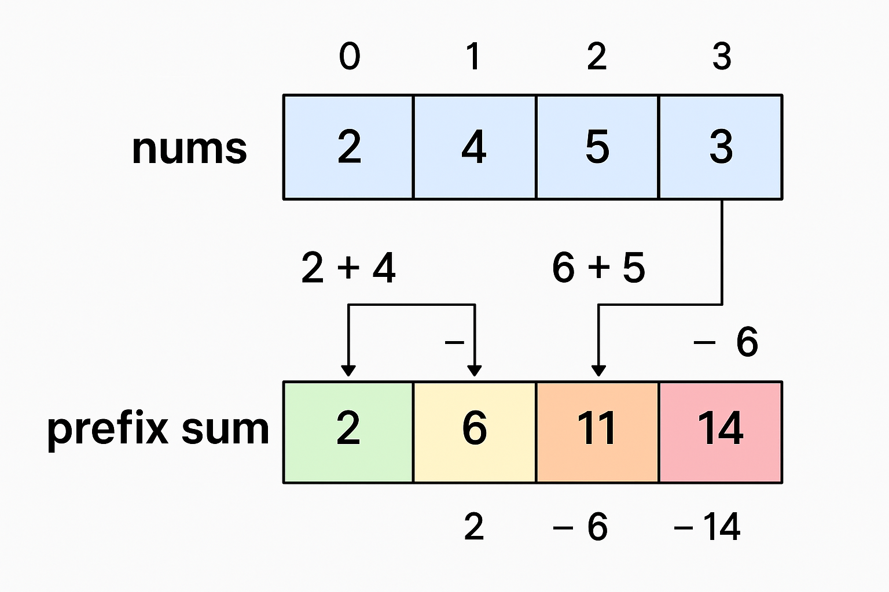

Claro! Vou explicar de forma simples, como se fosse para um iniciante.

---

## 📌 O que é Prefix Sum?

Imagine que você tem uma **lista de números** e quer saber rapidamente a soma de um pedaço dessa lista.

Por exemplo:
Lista: `[2, 4, 5, 3]`

Se eu te perguntar: **qual é a soma dos 3 primeiros números?**
Você vai somar:

```
2 + 4 + 5 = 11
```

Beleza.
Mas e se eu te perguntar várias vezes diferentes intervalos, tipo:

* Soma do índice 1 até 3 → `4 + 5 + 3 = 12`
* Soma do índice 0 até 2 → `2 + 4 + 5 = 11`
* Soma do índice 2 até 3 → `5 + 3 = 8`

Você teria que somar de novo toda vez. Isso pode ficar **lento** se a lista for grande.

---

## 💡 Ideia do Prefix Sum

O **Prefix Sum** resolve isso guardando um "acumulado" das somas **desde o começo até cada posição**.

No exemplo:

```
nums       = [  2,   4,   5,   3 ]
prefix_sum = [  2,   6,  11,  14 ]
```

O que significa:

* `prefix_sum[0]` = 2 → soma do primeiro número
* `prefix_sum[1]` = 6 → 2 + 4
* `prefix_sum[2]` = 11 → 2 + 4 + 5
* `prefix_sum[3]` = 14 → 2 + 4 + 5 + 3

---

## 🎯 Como usar para achar soma rápida de um intervalo

Se quero saber a soma do índice **i até j**, faço:

```
prefix_sum[j] - prefix_sum[i - 1]
```

(Se `i = 0`, é só usar `prefix_sum[j]`).

Exemplo: soma do índice 1 até 3 (`4 + 5 + 3`):

```
prefix_sum[3] - prefix_sum[0] = 14 - 2 = 12 ✅
```

---

## ⏱️ Vantagem

* **Sem Prefix Sum** → cada soma pode levar tempo proporcional ao tamanho do intervalo (lento para muitos pedidos).
* **Com Prefix Sum** → cada soma leva **tempo constante** (muito rápido).

---


Beleza 👍 Vou escrever um exemplo simples em JavaScript com **comentários linha por linha** para mostrar onde e como usar o **Prefix Sum**.

---

### 📌 Problema de exemplo

Temos um array de números e várias perguntas do tipo:

> "Qual é a soma dos elementos entre o índice `L` e o índice `R`?"

Vamos usar **Prefix Sum** para responder rápido.

---

```javascript
// Nosso array de exemplo
const nums = [2, 4, 5, 3];

// Passo 1: Criar um array para guardar o Prefix Sum
const prefixSum = [];

// Passo 2: Preencher o prefixSum
// prefixSum[i] vai guardar a soma de nums[0] até nums[i]
for (let i = 0; i < nums.length; i++) {
  if (i === 0) {
    // O primeiro elemento é igual no prefix sum
    prefixSum[i] = nums[i];
  } else {
    // Cada posição é a soma do número atual + prefixSum anterior
    prefixSum[i] = prefixSum[i - 1] + nums[i];
  }
}

console.log("Prefix Sum:", prefixSum); // [2, 6, 11, 14]

// Função para obter soma de um intervalo usando Prefix Sum
function rangeSum(L, R) {
  if (L === 0) {
    // Se começa no índice 0, a soma já está em prefixSum
    //No need to subtract anything—you're starting from the beginning.
    // [R]
    return prefixSum[R];
  } else {
    // Caso contrário, fazemos a diferença para obter apenas o intervalo desejado
    return prefixSum[R] - prefixSum[L - 1];
  }
}

// Testando:
// Soma do índice 1 ao 3 → 4 + 5 + 3 = 12
console.log(rangeSum(1, 3)); // 12

// Soma do índice 0 ao 2 → 2 + 4 + 5 = 11
console.log(rangeSum(0, 2)); // 11

// Soma do índice 2 ao 3 → 5 + 3 = 8
console.log(rangeSum(2, 3)); // 8
```

---

### 🔍 Explicação resumida:

1. **Construção do Prefix Sum** → `O(n)` (fazemos uma passagem pelo array).
2. **Consulta de soma** → `O(1)` (apenas uma subtração).
3. **Usa-se muito no LeetCode** quando há muitas perguntas sobre somas de subarrays.

---

Claro 👍 Vou fazer o desenho passo a passo para mostrar **visualmente** como o Prefix Sum funciona.

---

## 📊 Exemplo: `nums = [2, 4, 5, 3]`

### **Passo 1: Array original**

```
Índice:   0   1   2   3
nums  =  [2,  4,  5,  3]
```

---

### **Passo 2: Construindo o Prefix Sum**

| Índice `i` | Cálculo  | `prefixSum[i]` |
| ---------- | -------- | -------------- |
| 0          | `2`      | 2              |
| 1          | `2 + 4`  | 6              |
| 2          | `6 + 5`  | 11             |
| 3          | `11 + 3` | 14             |

Resultado:

```
prefixSum = [ 2,  6, 11, 14 ]
```

---

### **Passo 3: Como responder perguntas de soma**

#### Pergunta: Soma do índice **1 ao 3** (`4 + 5 + 3`)

```
prefixSum[3] - prefixSum[0]
= 14 - 2
= 12
```

✅ Soma rápida, sem ter que fazer `4 + 5 + 3` manualmente.

---

#### Pergunta: Soma do índice **0 ao 2** (`2 + 4 + 5`)

```
Como começa em 0 → é só pegar prefixSum[2]
= 11
```

---

#### Pergunta: Soma do índice **2 ao 3** (`5 + 3`)

```
prefixSum[3] - prefixSum[1]
= 14 - 6
= 8
```

---

📌 **Vantagem visual**

```
nums       = [ 2,  4,  5,  3 ]
prefixSum  = [ 2,  6, 11, 14 ]
```

Com o prefixSum pronto:

* Somar intervalo = **1 subtração**
* Sem prefixSum = teria que **somar manualmente** cada vez




 ## 303. Range Sum Query - Immutable


Entendi 👍
Esse problema do **LeetCode** é perfeito para aplicar **Prefix Sum**.
Vou te mostrar a solução passo a passo em **JavaScript**, usando a classe `NumArray` como o enunciado pede.

---

## 💡 Ideia

* **Pré-processar** o array para calcular o **prefix sum** na inicialização da classe.
* Assim, cada chamada de `sumRange(left, right)` é respondida em **O(1)**.

---

```javascript
class NumArray {
  constructor(nums) {
    // Cria um array prefixSum com tamanho nums.length + 1
    // prefixSum[0] = 0 para facilitar o cálculo
    this.prefixSum = new Array(nums.length + 1).fill(0);

    // Calcula o prefix sum
    for (let i = 0; i < nums.length; i++) {
      // prefixSum[i + 1] = soma até índice i
      this.prefixSum[i + 1] = this.prefixSum[i] + nums[i];
    }
  }

  sumRange(left, right) {
    // Soma do intervalo = prefixSum[right+1] - prefixSum[left]
    return this.prefixSum[right + 1] - this.prefixSum[left];
  }
}

// Teste do exemplo dado:
const numArray = new NumArray([-2, 0, 3, -5, 2, -1]);
console.log(numArray.sumRange(0, 2)); // 1
console.log(numArray.sumRange(2, 5)); // -1
console.log(numArray.sumRange(0, 5)); // -3
```

---

## 🔍 Explicação rápida

1. **Prefix Sum array** começa com `0` para facilitar subtrações:

   ```
   nums        = [-2,  0,  3, -5,  2, -1]
   prefixSum   = [ 0, -2, -2,  1, -4, -2, -3 ]
   ```
2. Para calcular `sumRange(left, right)`:

   ```
   sum = prefixSum[right+1] - prefixSum[left]
   ```

   Exemplo: `sumRange(0, 2)`

   ```
   = prefixSum[3] - prefixSum[0]
   = 1 - 0
   = 1 ✅
   ```

---

Eu entendo sua dúvida 👍
O **+1** nessas linhas é para lidar com um truque comum em Prefix Sum chamado **"prefix sum com índice deslocado"**.
Vou explicar de forma simples.

---

## 🔍 Sem deslocar (mais confuso)

Se fizermos `prefixSum[i]` significar “soma até o índice `i` de `nums`”, temos dois problemas:

1. Quando `left = 0`, não temos `prefixSum[left - 1]` (daria índice negativo).
2. Precisamos de **ifs** para tratar o caso especial `left = 0`.

---

## 💡 Solução: Criar prefixSum com tamanho `nums.length + 1`

* Fazemos `prefixSum[0] = 0` (significa “soma de nenhum elemento”).
* Assim:

  * `prefixSum[1]` = soma de `nums[0]`
  * `prefixSum[2]` = soma de `nums[0] + nums[1]`
  * ...
  * `prefixSum[n]` = soma de todo o array.

---

## 📊 Exemplo

```
nums        = [-2,   0,   3,  -5,   2,  -1]
índice nums =   0    1    2    3    4    5

prefixSum   = [ 0,  -2,  -2,   1,  -4,  -2,  -3 ]
índice pre  =   0    1    2    3    4    5    6
```

---

## 🎯 Como calcular soma rápido

Para achar `sumRange(left, right)`:

```
sum = prefixSum[right + 1] - prefixSum[left]
```

Exemplo: `sumRange(0, 2)` (somar -2, 0, 3):

```
prefixSum[3] - prefixSum[0]
= 1 - 0
= 1 ✅
```

Exemplo: `sumRange(2, 5)` (somar 3, -5, 2, -1):

```
prefixSum[6] - prefixSum[2]
= -3 - (-2)
= -3 + 2
= -1 ✅
```

---

## 📌 Resumo do porquê do **+1**

* Ele cria um **espaço extra no início** (`prefixSum[0] = 0`) para facilitar cálculos.
* Evita `if` para tratar `left = 0`.
* Torna a fórmula **única**:

  ```
  sum = prefixSum[right + 1] - prefixSum[left]
  ```

  sempre funciona.


 525. Contiguous Array
 560. Subarray Sum Equals K

 [Youtube Video](https://www.youtube.com/watch?v=yuws7YK0Yng&t=251s)