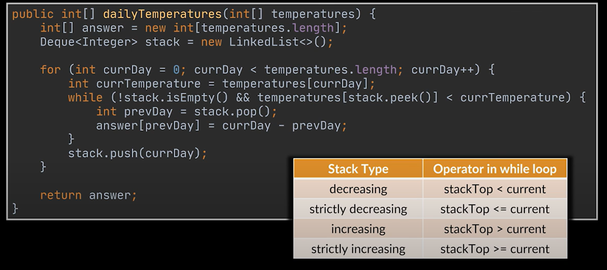

# Monotonic Stack

## Definition

In clear English, **monotonic** means something that always goes in **one direction** — it **never changes direction**.

For example:

* A **monotonic increasing** list: The numbers always go up or stay the same (e.g., 1, 2, 2, 3, 4).
* A **monotonic decreasing** list: The numbers always go down or stay the same (e.g., 9, 7, 7, 5, 2).

So, if something is **monotonic**, it either keeps increasing or keeps decreasing  but it never switches back and forth.

---

## 🧠 First, What is a Stack?

A **stack** is like a pile of plates:

* You **add** to the top (this is called **push**).
* You **remove** from the top (this is called **pop**).

So it's a **Last In, First Out** (LIFO) structure.

---

## 🧩 Now, What is a *Monotonic* Stack?

"Monotonic" just means **always going in one direction** — either always increasing or always decreasing.

So a **Monotonic Stack** is a stack where:

* The values inside are always going **up** (increasing) OR
* Always going **down** (decreasing)

👉 We use this to **quickly find the next bigger or smaller element** in an array.

---

## 🛠️ Why Use It?

Imagine you have a list of numbers and you want to know:

* "For each number, what is the **next bigger number** to the right?"
* Or: "What is the **next smaller number**?"

Doing this **without** a stack would be slow. With a **Monotonic Stack**, it’s much faster!

---

## 🧪 Example 1: Next Greater Element

Let's say we have this list:

```
[3, 1, 4, 2]
```

We want to know, for each number:

* What’s the **next greater number** to its right?

We'll use a **Monotonic Decreasing Stack** (stack goes down), which helps us find the next bigger number.

---

### 🔁 Step by Step:

We go from **right to left**, keeping the stack with numbers in **decreasing** order (big to small).

Start with an empty stack and go backwards:

1. **Start with 2**

   * Stack: empty → No greater number → Result: `-1`
   * Push 2 onto the stack → Stack: `[2]`

2. **Now look at 4**

   * 4 > 2 → pop 2
   * Stack is empty → No greater number → Result: `-1`
   * Push 4 → Stack: `[4]`

3. **Now look at 1**

   * 1 < 4 → 4 is next greater → Result: `4`
   * Push 1 → Stack: `[4, 1]`

4. **Now look at 3**

   * 3 > 1 → pop 1
   * 3 < 4 → 4 is next greater → Result: `4`
   * Push 3 → Stack: `[4, 3]`

✅ Final result:

```
[4, 4, -1, -1]
```

---

## 🎯 Key Rules:

* **Push** numbers on the stack while keeping the order you want (increasing or decreasing).
* **Pop** when the current number **breaks** that order (e.g., it's bigger than the top).
* After popping, if the stack still has something, that’s your answer!

---

## ⛓ Common Uses:

* Next Greater Element
* Daily Temperatures (next warmer day)
* Stock Span
* Histogram Largest Rectangle

---

## 🧵 In Simple Words:

> A **Monotonic Stack** is like a smart memory helper. As you look at each number, it tells you “Hey! Remember that number you were wondering about? I found what it was looking for!”

---

Absolutely! Let's write a **simple and fully commented JavaScript example** using the **Monotonic Stack** pattern to solve the "**Next Greater Element**" problem.

---

## 🧪 Problem:

Given an array, for each element, find the next greater element to its **right**.
If there is no greater element, return `-1` for that position.

### 🧾 Example Input:

```js
[3, 1, 4, 2]
```

### ✅ Expected Output:

```js
[4, 4, -1, -1]
```

---

## 💻 JavaScript Code with Simple Comments

```javascript
function nextGreaterElement(nums) {
  // Create an array to store the result, filled with -1 initially
  let result = new Array(nums.length).fill(-1);

  // This stack will store indexes of elements in nums
  let stack = [];

  // Loop through the array from right to left
  for (let i = nums.length - 1; i >= 0; i--) {
    // Remove elements from the stack that are smaller or equal to nums[i]
    // because they can't be the "next greater" for current element
    while (stack.length > 0 && nums[stack[stack.length - 1]] <= nums[i]) {
      stack.pop();
    }

    // If stack is not empty, then the top element is the next greater
    if (stack.length > 0) {
      result[i] = nums[stack[stack.length - 1]];
    }

    // Push the current index onto the stack
    stack.push(i);
  }

  return result;
}

// 👉 Try it with an example
let input = [3, 1, 4, 2];
let output = nextGreaterElement(input);

console.log("Input: ", input);     // [3, 1, 4, 2]
console.log("Output: ", output);   // [4, 4, -1, -1]
```

---

## 🧠 What's Happening in Simple Words:

* We go from **right to left** because we're looking for the **next** greater element.
* We use a **stack to remember candidates** for being "greater".
* If the current number is **smaller than what's on the stack**, the top of the stack is the next greater number.
* If not, we **pop** from the stack until we find a bigger number (or the stack is empty).

---

## 🧺 Stack Values Example Walkthrough (for `[3, 1, 4, 2]`):

| i | nums\[i] | Stack             | Result |
| - | -------- | ----------------- | ------ |
| 3 | 2        | \[] → \[3]        | -1     |
| 2 | 4        | \[3] → \[] → \[2] | -1     |
| 1 | 1        | \[2]              | 4      |
| 0 | 3        | \[2,1] → \[2]     | 4      |

---


# Portuguese

Claro! Vamos explicar esse código passo a passo, **em português e de forma bem simples**, como se você fosse um iniciante total em programação.

---

## 🤔 O que essa função faz?

Dada uma lista de números, ela responde:

> “Para cada número, qual é o **próximo número maior** que aparece à **direita** dele?”

Se não tiver nenhum número maior depois dele, colocamos `-1`.

---

### 🧪 Exemplo:

Se a entrada for:

```js
[3, 1, 4, 2]
```

A resposta será:

```js
[4, 4, -1, -1]
```

#### Por quê?

* Depois do **3**, o próximo número maior é **4**
* Depois do **1**, o próximo número maior também é **4**
* Depois do **4**, não tem nenhum número maior → `-1`
* Depois do **2**, também não tem → `-1`

---

## 🧠 Conceito importante: **Pilha (Stack)**

Uma **pilha** funciona como uma pilha de pratos:

* Você **coloca** um prato no topo (push)
* Você **tira** sempre o prato do topo (pop)

Neste algoritmo, usamos a pilha para **lembrar os candidatos a serem os próximos maiores números**.

---

## 📃 Explicando o código em português simples

```js
function nextGreaterElement(nums) {
```

👉 Criamos uma função que recebe uma lista chamada `nums`.

---

```js
  let result = new Array(nums.length).fill(-1);
```

👉 Criamos uma nova lista do mesmo tamanho da original, preenchida com `-1`, que vai guardar os resultados.

---

```js
  let stack = [];
```

👉 Criamos uma pilha (chamada `stack`) para nos ajudar a lembrar os próximos números.

---

```js
  for (let i = nums.length - 1; i >= 0; i--) {
```

👉 Vamos olhar os números **da direita para a esquerda**.

---

```js
    while (stack.length > 0 && nums[stack[stack.length - 1]] <= nums[i]) {
      stack.pop();
    }
```

👉 Enquanto:

* A pilha **não estiver vazia**
* E o número que está no topo da pilha **for menor ou igual** ao número atual...

Então **removemos** esse número da pilha (com `pop()`), pois ele não serve mais como “próximo maior”.

---

```js
    if (stack.length > 0) {
      result[i] = nums[stack[stack.length - 1]];
    }
```

👉 Se a pilha **ainda tiver algo** depois de limpar os menores, o número que está no topo da pilha é o **próximo maior** → guardamos ele no `result`.

---

```js
    stack.push(i);
```

👉 Agora, colocamos o **índice do número atual** na pilha, para talvez ele servir como próximo maior para os números anteriores.

---

```js
  return result;
}
```

👉 No final, devolvemos a lista de respostas.

---

## ✅ Teste com exemplo:

```js
let input = [3, 1, 4, 2];
let output = nextGreaterElement(input);
console.log("Input: ", input);     // [3, 1, 4, 2]
console.log("Output: ", output);   // [4, 4, -1, -1]
```

---

## 🔄 Resumo visual do funcionamento:

Para cada número, a função:

1. **Remove da pilha os números menores** do que ele (porque não servem como "próximo maior").
2. Vê se tem **algum número maior** na pilha — se tiver, guarda.
3. **Adiciona o número atual** à pilha (pode ser útil para os próximos).

---

Se quiser, posso te mostrar uma **versão com `console.log()` dentro do `for`** para ver o que está acontecendo a cada passo. Quer?


## Logic CODE 

**Increasing Memory**
```
create an empty stack
for each element in the array:
    while stack is not empty AND top of the stack is greater than the current element:
        pop the stack
    push the current element to stack
```


**Decreasing Memory**
```
create an empty stack
for each element in the array:
    while stack is not empty AND top of the stack is smaller than the current element:
        pop the stack
    push the current element to stack
```



## Links

[Good explaination](https://www.designgurus.io/course-play/grokking-the-coding-interview/doc/introduction-to-monotonic-stack?gad_source=2&gad_campaignid=21052024757&gclid=EAIaIQobChMI8LeFucrxjwMVCJKDBx0TSQdYEAEYASAAEgKspfD_BwE)

[Water Trapped Units](https://www.youtube.com/watch?v=15OuNilu0r0)

[Quickly Explantion](https://www.youtube.com/shorts/SiomoI83jIY)

[Google Interview](https://www.youtube.com/watch?v=DmHEl0v_hO0)


Claro! Vamos lá!

---

## 🧠 O que é um **Monotonic Stack**?

### ✅ Explicação simples

Imagina que você está empilhando **caixas** (como se fosse uma torre). Você quer que essa torre tenha uma **ordem** especial:

* Ou as caixas vão ficando **maiores** conforme você empilha (do menor para o maior).
* Ou vão ficando **menores** (do maior para o menor).

Essa pilha é chamada de **pilha monótona** (do inglês: **monotonic stack**), porque ela **mantém uma ordem** (crescente ou decrescente).

Usamos esse tipo de pilha para resolver **problemas que precisam comparar elementos vizinhos** de uma lista ou array, como:

* Qual é o **próximo número maior**?
* Qual é o **último número menor**?
* Etc.

---

## 📌 Exemplo prático:

Vamos resolver um problema bem comum:

### 🔍 Problema:

Dado um array de números, para cada número, diga qual é o **próximo número maior à sua direita**.
Se não tiver nenhum número maior depois, diga `-1`.

Exemplo:

```js
Entrada:  [2, 1, 5, 3, 6]
Saída:    [5, 5, 6, 6, -1]
```

---

## 📄 Código em JavaScript (com explicações linha por linha):

```js
function proximoMaior(nums) {
  const stack = [];      // pilha para guardar os índices dos números
  const resultado = new Array(nums.length).fill(-1); // array com -1 como padrão

  for (let i = 0; i < nums.length; i++) {
    // Enquanto a pilha NÃO estiver vazia e o número atual for MAIOR
    // do que o número que está no topo da pilha
    while (stack.length > 0 && nums[i] > nums[stack[stack.length - 1]]) {
      const indiceMenor = stack.pop();         // tira o topo da pilha (índice anterior)
      resultado[indiceMenor] = nums[i];        // atualiza o resultado: achamos o próximo maior!
    }

    stack.push(i);  // adiciona o índice atual na pilha
  }

  return resultado;
}
```

---

## 🧩 Explicando passo a passo com o exemplo `[2, 1, 5, 3, 6]`:

### Início:

* `stack = []` (vazia)
* `resultado = [-1, -1, -1, -1, -1]`

---

### 🔄 Laço começa:

#### i = 0 → `nums[0] = 2`

* Pilha está vazia → adiciona índice `0`
* `stack = [0]`

---

#### i = 1 → `nums[1] = 1`

* `1` **não** é maior que `2` (topo da pilha)
* Adiciona índice `1`
* `stack = [0, 1]`

---

#### i = 2 → `nums[2] = 5`

* `5 > 1` (índice 1 na pilha) → tira `1` da pilha, `resultado[1] = 5`
* `5 > 2` (índice 0 na pilha) → tira `0` da pilha, `resultado[0] = 5`
* Adiciona índice `2`
* `stack = [2]`
* `resultado = [5, 5, -1, -1, -1]`

---

#### i = 3 → `nums[3] = 3`

* `3 < 5` → não faz nada
* Adiciona `3` na pilha
* `stack = [2, 3]`

---

#### i = 4 → `nums[4] = 6`

* `6 > 3` → tira `3` da pilha, `resultado[3] = 6`
* `6 > 5` → tira `2` da pilha, `resultado[2] = 6`
* Adiciona `4` na pilha
* `stack = [4]`
* `resultado = [5, 5, 6, 6, -1]`

---

### ✅ Resultado final:

```js
[5, 5, 6, 6, -1]
```

---

## 📦 Resumo:

* Usamos uma **pilha** para guardar os **índices** dos números.
* A pilha vai **guardando os candidatos** que ainda não acharam seu "próximo maior".
* Quando encontramos um número **maior que o do topo da pilha**, resolvemos a resposta daquele índice.

---


